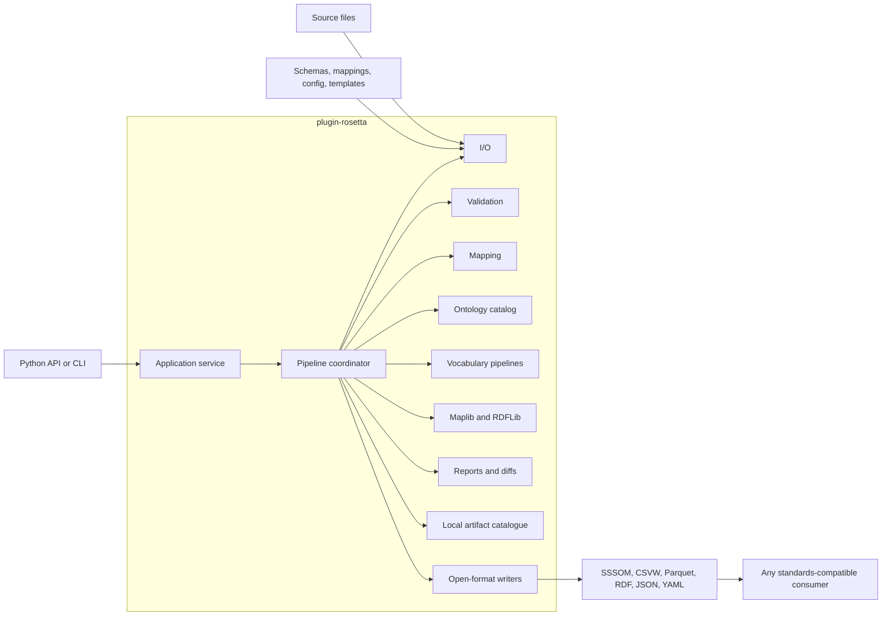

# Build and migration plan

## Goal

Build `plugin-rosetta` as a clean, mapping-agnostic Python package and migrate working behaviour from [`sssom-rosetta`](https://github.com/plugin-healthcare/sssom-rosetta) into the new structure.

The first release covers mapping files, ontologies, vocabularies, graph generation, validation, open outputs, and a basic local artifact catalogue.

FHIR runtime transformation, a UI, new mapping-generation techniques, and remote storage are deferred.

## Preserved content

The current authored mapping data is preserved under `registry/mappings/`.

The mapping-set identifier, licence, file references, and CURIE map from the old `justfile` are preserved in `registry/config/mapping-sets.yaml`.

Do not alter preserved mapping values silently.

The existing `author_label` values need a separate reviewed correction because byte-preserving migration currently retains the legacy value.

## Package foundation

- Use `plugin-rosetta` for the distribution and `plugin_rosetta` for the import package.
- Install the CLI as `rosetta = "plugin_rosetta.cli:app"`.
- Use the `uv_build` build backend.
- Use Polars `LazyFrame` for tabular processing where practical.
- Use Pydantic for configuration, manifests, and structured metadata.
- Use Maplib as a core dependency for large vocabulary graph construction and merge.
- Use RDFLib as a direct dependency for ontology and mapping RDF reading and writing.
- Declare CSVW, Curies, LinkML Runtime, and the HTTP client directly instead of relying on transitive dependencies.
- Pin `sssom-schema` to the exact version used to generate the migrated model before moving `models/sssom.py`.
- Introduce Nyctea with the vocabulary-frame validation slice, where it replaces manual column and content checks.
- Run locally without requiring an always-on service.
- Keep `just` recipes as thin wrappers around package CLI commands.
- Publish open-standard files that can be read and used without Rosetta.

Preferred outputs include SSSOM, CSVW, Parquet, RDF/Turtle, and plain JSON or YAML metadata.

## Package structure

```text
src/plugin_rosetta/
  core/             # errors, validation reports, and proven shared protocols
  config/           # Pydantic configuration and source definitions
  io/               # CSVW, SSSOM, Parquet, YAML, and RDF boundaries
  mapping/          # authoring, normalization, validation, reports, and diffs
  ontology/         # source catalogue, loading, caching, and IRI lookup
  vocabulary/       # ingest and source-specific release-to-graph pipelines
  graph/            # Maplib graph construction and RDFLib graph I/O
  artifacts/        # local artifact identities, versions, dependencies, and impact
  application/      # use cases called by the Python API and CLI
  cli.py            # thin Typer commands
```

Do not create every module or protocol upfront.

Add a shared protocol only when a tested vertical slice needs it or a second implementation proves the common contract.

## Local content catalogue

```text
registry/
  config/    # tracked source and mapping-set configuration
  schemas/   # tracked validation and artifact schemas
  mappings/  # tracked mapping CSV and CSVW metadata
  data/      # ignored raw, licensed, cached, and generated payloads
```

Use `registry/data/ontologies/` and `registry/data/vocabularies/` as the new default cache roots.

Open sources use reusable package download code with pinned versions, URLs, and checksums.

Licence-gated vocabulary archives use manual local-file ingest.

## Mapping pipeline



The application service receives file references and configuration and triggers the pipeline.

The pipeline coordinates modules; modules do not call the CLI or depend on fixed storage locations.

## Migration inventory

| `sssom-rosetta` area | Target | Decision |
| --- | --- | --- |
| `mapping/author.py`, `validate.py`, `io.py`, `report.py` | `mapping/`, `io/` | Migrate graph-free I/O first, then graph-resolved authoring and referential validation |
| `mapping/docs_pages.py` | `mapping/` | Fold into the report story as optional documentation output |
| `mapping/gephi.py`, `mapping/protege.py` | Deferred | Visualisation exports are not required for the first release |
| `ontology/sources.py`, `loader.py`, `catalog.py` | `ontology/` | Move source declarations to tracked YAML and preserve fetch/cache behaviour |
| `vocabulary/sources.py`, `fetch.py`, `pipeline.py` | `vocabulary/` | Preserve source lookup, manual ZIP ingest, and shared build behaviour |
| `vocabulary/omop.py`, `dhd.py`, `loinc_snomed.py`, `snomed_international.py` | `vocabulary/` | Migrate one format slice at a time |
| `vocabulary/merge.py`, `namespaces.py`, `templates.py` | `graph/` and tracked content | Preserve load-bearing merge, namespace, and template behaviour |
| `models/sssom.py` | `mapping/models/` | Regenerate from the exact pinned schema and never hand-edit |
| `cli.py` and `justfile` | `application/`, `cli.py`, `justfile` | Move behaviour into application functions and keep commands thin |
| existing tests and fixtures | matching `tests/` modules | Port behaviour first and keep tests synthetic and offline |

Do not migrate generated artifacts, licensed source data, duplicated pipelines, or silent-failure behaviour.

## Implementation sequence

Each milestone is a reviewable increment.

Write a failing test for the next behaviour, implement the minimum code, and run `tara check` before starting the next milestone.

### 1. Establish an installable package

- Replace the empty `src/rosetta/` directory with `src/plugin_rosetta/`.
- Add `uv_build`, the `rosetta` console script, direct dependencies, and the quality-tool configuration.
- Add the Typer application with help output but no mapping behaviour.
- Add the package error hierarchy and shared validation report.
- Add reader, writer, and validator protocols only.
- Add `install`, `test`, `lint`, `format`, `typecheck`, and `check` recipes.

**Exit:** a clean checkout installs, `rosetta --help` runs, and `tara check` passes without reading a mapping format.

### 2. Migrate graph-free mapping I/O and reports

- Load the tracked mapping-set configuration with a frozen Pydantic model.
- Port CURIE expansion, CSVW schema conformance, CSVW reading, SSSOM writing, Turtle writing, and report generation.
- Preserve all eight `omop-onz-g` rows and multivalued SSSOM fields.
- Regenerate the SSSOM model from the exact pinned schema.
- Add application functions and thin `rosetta mapping validate`, `build`, and `report` commands.
- Keep referential integrity and graph-resolved authoring out of this milestone.

**Exit:** the preserved mapping set reads as eight rows and produces deterministic SSSOM, Turtle, Markdown, and HTML outputs that standard tools can read without Rosetta.

### 3. Migrate ontology loading and referential validation

- Port tracked ontology-source configuration, open-source download, cache reuse, RDF loading, label lookup, and identifier existence checks.
- Move source definitions from Python globals into `registry/config/ontology-sources.yaml`.
- Use `registry/data/ontologies/` as the default cache.
- Port graph-resolved mapping authoring and referential-integrity validation.
- Make missing checksums, unknown prefixes, missing identifiers, and nondeterministic labels explicit errors or validation issues.

**Exit:** the preserved mapping validates its subject and object identifiers against configured OMOP and ONZ-G ontology fixtures.

### 4. Migrate vocabulary and graph pipelines

- Port vocabulary source configuration and licence-gated local-ZIP ingest.
- Use `registry/data/vocabularies/` as the default cache.
- Migrate OMOP/Athena first.
- Migrate DHD DT/VT second and then extract the shared source-adapter contract.
- Migrate LOINC-SNOMED, SNOMED International, namespace handling, and graph merge as later slices.
- Integrate Nyctea where it replaces manual release-frame checks.
- Preserve specialty-scoped DBC diagnosis identity from `dhd.load_dbc` and `namespaces.dbc_iri`.
- Use synthetic fixtures shaped like real releases and never commit licensed content.

**Exit:** every migrated adapter passes shared contract tests and the merged open RDF output has equivalent semantics to `sssom-rosetta`.

### 5. Add basic local artifact versions and differences

- Add content-addressed artifact versions and provenance manifests after the mapping and graph formats are stable.
- Implement local register, list, and diff operations.
- Add checksum, schema, keyed-row, SSSOM mapping, and RDF triple differences as separate slices.
- Report which mappings and graphs are affected by a source upgrade.
- Extract a storage protocol only after the local implementation is tested.

**Exit:** a new local source or mapping version can be registered, compared with the current version, and inspected before use.

### 6. Integrate and release

- Compare retained workflows and outputs with `sssom-rosetta`.
- Require equivalent open-format semantics or an approved documented difference.
- Complete CLI commands over application functions.
- Add a short README quickstart and runnable example.
- Build and install the wheel in a clean environment.
- Publish a capability matrix listing migrated sources, formats, and explicitly deferred behaviour.

**Exit:** `tara check` passes, the installed wheel runs the example, and every retained `sssom-rosetta` workflow has a named replacement test.

## Explicit failure cases

- A source without a pinned checksum must produce a visible validation issue rather than an informational log only.
- Unknown CURIE prefixes and missing ontology identifiers must fail before output is written.
- Multilingual label selection must be deterministic.
- Empty and absent mapping cells must not become indistinguishable without a warning.
- Maplib templates must report how many triples were omitted because optional input values were null.
- Invalid input must never leave partial output files.

## Deferred

- S3-compatible artifact storage.
- Aliases, promotion, rollback, metadata migration, and garbage collection.
- Gephi and Protégé exports.
- FHIR-to-OMOP and OMOP-to-FHIR transformation artifacts and runtime.
- A reusable runtime package.
- A mapping UI.
- SQL on FHIR.
- Ariadne-based mapping generation and evaluation.

## Completion criteria

- Generic modules contain no healthcare-specific logic.
- New formats and vocabularies connect through adapters extracted from working implementations.
- Mapping content is editable without changing Python code.
- Outputs use documented open formats and require no Rosetta dependency.
- Source and mapping upgrades produce clear differences before use.
- No licensed data, generated graphs, credentials, or local configuration are packaged.
